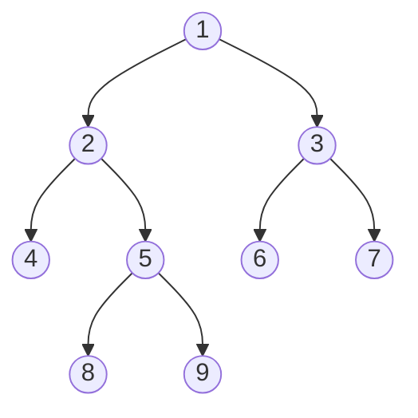

二叉树是每个节点最多只有两个分支的树结构。通常分支被称为“左子树”或者“右子树”。二叉树的分支具有左右次序，不能随意颠倒。 

# 树的遍历
二叉树主要有四种遍历方式：
1. 前序遍历：根节点->左子树->右子树
2. 中序遍历：左子树->根节点->右子树
3. 后序遍历：左子树->右子树->根节点
4. 层次遍历：按层遍历

例如，我们求下图二叉树的各种遍历：



前序遍历： 1， 2， 4， 5， 8， 9， 3， 6， 7
中序遍历： 4， 2， 8， 5， 9， 1， 6， 3， 7
后序遍历： 4， 8， 9， 5， 2， 6， 7， 3， 1
层级遍历： 1， 2， 3， 4， 5， 6， 7， 8， 9

## 二叉树实现
下面我们用python实现二叉树：
```python
class TreeNode(object):
    def __init__(self, x):
        self.val = x
        self.left = None
        self.right = None
        
root = TreeNode(1)
root.left = TreeNode(2)
root.right = TreeNode(3)
root.left.left = TreeNode(4)
root.left.right = TreeNode(5)
root.left.right.left = TreeNode(8)
root.left.right.right = TreeNode(9)
root.right.left = TreeNode(6)
root.right.right = TreeNode(7)
```

## 前序遍历
前序遍历采用根左右的方式进行遍历。前序遍历的代码实现主要有两种方式，第一种是采用递归的方式，第二种是迭代的方式。递归的方式比较容易理解，也比较直观。
### 递归法
```python
class Solution(object):
    def preorderTraversal(self, root):
        def dfs(cur):
            if not cur:
                return 
            res.append(cur.val)
            dfs(cur.left)
            dfs(cur.right)
            
        res = [] 
        dfs(root)
        return res
S = Solution()
S.preorderTraversal(root)
```
### 迭代法
```python
class Solution(object):
    def preorderTraversal(self, root):
        """
        :type root: TreeNode
        :rtype: List[int]
        """
        result = [] 
        stack = [] 
        stack.append(root)
        while stack:
            node = stack.pop()
            result.append(node.val)
            if node.right:
                stack.append(node.right)
            if node.left:
                stack.append(node.left)
        return result
S = Solution()
S.preorderTraversal(root)
```

## 中序遍历
中序遍历采用左根右的顺序进行遍历，同样可以采用递归法和迭代法两种程序实现方法。
1. 递归法
```python
## 方法1：递归
class Solution(object):
    def inorderTraversal(self, root):
        def dfs(cur):
            if not cur:
                return 
            dfs(cur.left)
            res.append(cur.val)
            dfs(cur.right)
            
        res = [] 
        dfs(root)
        return res
S = Solution()
S.inorderTraversal(root)
```
2. 迭代法
```python
## 方法2：迭代
class Solution(object):
    def inorderTraversal(self, root):
        """
        :type root: TreeNode
        :rtype: List[int]
        """
        result = []
        if not root:
            return result
        
        stack = [] 
        cur = root 
        while stack or cur:
            while cur:
                stack.append(cur)
                cur = cur.left 
            cur = stack.pop()
            result.append(cur.val)
            cur = cur.right 
        return result
S = Solution()
S.inorderTraversal(root)
```

## 后序遍历
后序遍历采用右根左的方向进行遍历，同样有回归法和迭代法两种程序实现方式。
1. 递归法
```python
## 方法1： 递归
class Solution(object):
    def postorderTraversal(self, root):
        def dfs(cur):
            if not cur:
                return 
            dfs(cur.left)
            dfs(cur.right)
            res.append(cur.val)
        res = [] 
        dfs(root)
        return res

S = Solution()
S.postorderTraversal(root)
```
2. 迭代法
```python
## 方法2：迭代
class Solution(object):
    def postorderTraversal(self, root):
        """
        :type root: TreeNode
        :rtype: List[int]
        """
        result = []
        if not root:
            return result
        
        stack = [] 
        stack.append(root)
        while stack:
            cur = stack.pop()
            result.append(cur.val)
            if cur.left:
                stack.append(cur.left)
            if cur.right:
                stack.append(cur.right)
        return result[::-1]
S = Solution()
S.postorderTraversal(root)
```
## 层序遍历
```python
class Solution(object):
    def levelOrder(self, root):
        """
        :type root: TreeNode
        :rtype: List[int]
        """
        result = [] 
        queue = [] 
        queue.append(root)
        while queue:
            node = queue.pop(0)
            result.append(node.val)
            if node.left:
                queue.append(node.left)
            if node.right:
                queue.append(node.right)
        return result 

S = Solution()
S.levelOrder(root)
```

## 翻转二叉树
这里我们实现了一下如何翻转二叉树，也就是实现二叉树的左右翻转。我们采用了递归的方法进行实现。
```python 
class Solution(object):
    def invertTree(self, root):
        """
        :type root: TreeNode
        :rtype: TreeNode
        """
        if not root:
            return 
        root.left, root.right = root.right, root.left
        self.invertTree(root.left)
        self.invertTree(root.right)
        return root
S = Solution()
S.invertTree(root)
```
